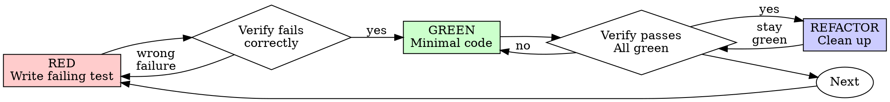

# Test-Driven Development (TDD)

## Overview

테스트를 먼저 작성하십시오. 실패를 확인하십시오. 통과에 필요한 최소 코드만 작성하십시오.

**핵심 원칙:** 테스트가 실제로 실패하는 것을 보지 않았다면, 그 테스트가 올바른 대상을 검증하는지 알 수 없습니다.

**규칙의 문구만 지키고 본질을 어기는 것도 규칙 위반입니다.**

## When to Use

**항상:**
- 신규 기능
- 버그 수정
- 리팩터링
- 동작 변경

**예외(반드시 human partner에게 확인):**
- 버려질 프로토타입
- 생성 코드
- 설정 파일

"이번 한 번은 TDD 생략"이라는 생각이 들면 멈추십시오. 그것은 합리화입니다.

## The Iron Law

```
NO PRODUCTION CODE WITHOUT A FAILING TEST FIRST
```

테스트보다 먼저 코드를 작성했다면? 삭제하고 다시 시작하십시오.

**예외 없음:**
- "참고용"으로 남기지 말 것
- 테스트를 쓰면서 "조금만 수정"하지 말 것
- 보지도 말 것
- 삭제는 진짜 삭제를 의미

테스트에서 다시 시작해 새로 구현하십시오. 끝입니다.

## Red-Green-Refactor



### RED - Write Failing Test

기대 동작을 보여주는 최소 실패 테스트를 하나 작성합니다.

<Good>
```typescript
test('retries failed operations 3 times', async () => {
  let attempts = 0;
  const operation = () => {
    attempts++;
    if (attempts < 3) throw new Error('fail');
    return 'success';
  };

  const result = await retryOperation(operation);

  expect(result).toBe('success');
  expect(attempts).toBe(3);
});
```
이름이 명확하고, 실제 동작을 검증하며, 한 가지에 집중
</Good>

<Bad>
```typescript
test('retry works', async () => {
  const mock = jest.fn()
    .mockRejectedValueOnce(new Error())
    .mockRejectedValueOnce(new Error())
    .mockResolvedValueOnce('success');
  await retryOperation(mock);
  expect(mock).toHaveBeenCalledTimes(3);
});
```
이름이 모호하고, 코드가 아닌 mock을 검증
</Bad>

**요구사항:**
- 단일 동작
- 명확한 이름
- 실제 코드 검증(mock은 불가피할 때만)

### Verify RED - Watch It Fail

**필수. 절대 생략 금지.**

```bash
npm test path/to/test.test.ts
```

확인 항목:
- 테스트가 실패한다(에러 아님)
- 실패 메시지가 예상과 일치
- 기능 부재로 실패한다(오타/환경 문제 아님)

**테스트가 통과하면?** 기존 동작을 테스트한 것입니다. 테스트를 수정하십시오.

**테스트가 에러면?** 에러를 고치고, "의도된 실패"가 나올 때까지 재실행하십시오.

### GREEN - Minimal Code

테스트를 통과시키는 가장 단순한 코드를 작성합니다.

<Good>
```typescript
async function retryOperation<T>(fn: () => Promise<T>): Promise<T> {
  for (let i = 0; i < 3; i++) {
    try {
      return await fn();
    } catch (e) {
      if (i === 2) throw e;
    }
  }
  throw new Error('unreachable');
}
```
통과에 필요한 최소 구현
</Good>

<Bad>
```typescript
async function retryOperation<T>(
  fn: () => Promise<T>,
  options?: {
    maxRetries?: number;
    backoff?: 'linear' | 'exponential';
    onRetry?: (attempt: number) => void;
  }
): Promise<T> {
  // YAGNI
}
```
과도한 설계
</Bad>

기능 추가, 주변 리팩터, 테스트 범위 밖 "개선" 금지.

### Verify GREEN - Watch It Pass

**필수.**

```bash
npm test path/to/test.test.ts
```

확인 항목:
- 대상 테스트 통과
- 관련 테스트도 통과
- 출력이 깨끗함(에러/경고 없음)

**대상 테스트 실패?** 테스트가 아니라 구현 코드를 수정하십시오.

**다른 테스트 실패?** 지금 바로 수정하십시오.

### REFACTOR - Clean Up

GREEN 이후에만:
- 중복 제거
- 이름 개선
- 헬퍼 추출

항상 테스트 녹색 유지. 동작 추가 금지.

### Repeat

다음 기능도 다시 failing test에서 시작합니다.

## Good Tests

| Quality | Good | Bad |
|---------|------|-----|
| **Minimal** | 한 가지 검증. 이름에 "and"가 보이면 분리 | `test('validates email and domain and whitespace')` |
| **Clear** | 이름만으로 동작이 드러남 | `test('test1')` |
| **Shows intent** | 원하는 API/동작을 명확히 표현 | 코드 의도를 숨김 |

## Why Order Matters

**"코드를 먼저 짜고, 나중에 테스트로 검증하면 된다"**

코드 이후에 쓴 테스트는 즉시 통과하기 쉽습니다. 즉시 통과는 아무것도 증명하지 않습니다.
- 잘못된 대상을 테스트했을 수 있음
- 동작이 아니라 구현 디테일을 테스트했을 수 있음
- 놓친 엣지 케이스가 있을 수 있음
- 테스트가 버그를 실제로 잡는지 확인하지 못함

Test-first는 테스트가 실제로 실패하는 순간을 강제해, 테스트 유효성을 증명합니다.

**"엣지 케이스는 이미 수동 테스트했다"**

수동 테스트는 임시적입니다.
- 무엇을 테스트했는지 기록이 없음
- 코드가 바뀔 때 재실행 어려움
- 압박 상황에서 케이스 누락 쉬움
- "내가 해볼 때 됐음"은 포괄 검증이 아님

자동 테스트는 체계적이며 매번 같은 방식으로 실행됩니다.

**"X시간 작업을 지우는 건 낭비다"**

매몰비용 오류입니다. 시간은 이미 사용되었습니다. 지금의 선택은 둘뿐입니다.
- 지우고 TDD로 다시 작성 (추가 X시간, 높은 신뢰)
- 유지하고 사후 테스트 추가 (당장은 빠름, 낮은 신뢰, 버그 가능성 높음)

진짜 낭비는 신뢰할 수 없는 코드를 유지하는 것입니다. 검증 없는 동작 코드는 기술부채입니다.

**"TDD는 교조적이고, 현실적으론 유연해야 한다"**

TDD가 현실적입니다.
- 커밋 전 버그를 발견 (사후 디버깅보다 빠름)
- 회귀 방지 (깨짐을 즉시 포착)
- 동작 문서화 (테스트가 사용법을 설명)
- 리팩터링 가능성 확대 (깨지면 테스트가 즉시 알려줌)

"현실적 지름길"은 결국 프로덕션 디버깅으로 이어져 더 느립니다.

**"나중 테스트도 목적은 같다. 의식보다 본질"**

아닙니다. 사후 테스트는 "현재 코드가 무엇을 하는가"를 묻습니다. 테스트 우선은 "무엇을 해야 하는가"를 묻습니다.

사후 테스트는 구현 편향이 강합니다. 요구사항보다 지금 작성한 코드에 맞춰 테스트하게 됩니다. 기억난 엣지 케이스만 검증하게 됩니다.

테스트 우선은 구현 전 엣지 케이스 탐색을 강제합니다. 사후 테스트는 "기억이 정확했는지"만 확인합니다(보통 정확하지 않습니다).

사후 30분 테스트는 TDD가 아닙니다. 커버리지는 얻어도, 테스트 유효성 증명은 잃습니다.

## Common Rationalizations

| Excuse | Reality |
|--------|---------|
| "너무 단순해서 테스트 불필요" | 단순 코드도 깨집니다. 테스트 30초면 됩니다. |
| "나중에 테스트하자" | 즉시 통과하는 테스트는 증명력이 없습니다. |
| "사후 테스트도 같은 효과" | 사후: "무엇을 하지?" 선행: "무엇을 해야 하지?" |
| "수동 테스트 완료" | 임시는 체계가 아닙니다. 기록/재실행 불가. |
| "X시간 삭제는 낭비" | 매몰비용입니다. 미검증 코드는 부채입니다. |
| "참고용으로 남기고 테스트 먼저" | 결국 참조 구현에 끌려갑니다. 삭제는 삭제입니다. |
| "먼저 탐색이 필요" | 탐색은 가능. 다만 탐색 코드는 버리고 TDD로 재시작. |
| "테스트가 어렵다 = 테스트 문제" | 보통 설계 문제입니다. 테스트 어려움은 사용 어려움 신호입니다. |
| "TDD는 느리다" | TDD는 디버깅보다 빠릅니다. 현실적 선택은 test-first입니다. |
| "수동이 더 빠르다" | 수동은 엣지 케이스를 증명하지 못합니다. 변경마다 반복됩니다. |
| "기존 코드도 테스트 없음" | 그래서 지금 개선해야 합니다. 기존 코드도 테스트 추가. |

## Red Flags - STOP and Start Over

- 테스트 전에 코드 작성
- 구현 후 테스트 작성
- 테스트가 즉시 통과
- 왜 실패했는지 설명 불가
- "나중에" 테스트 추가
- "이번 한 번만" 합리화
- "수동으로 이미 확인" 주장
- "사후 테스트도 목적 동일" 주장
- "의식보다 본질" 주장
- "참고용 유지" 또는 "기존 코드 적응" 주장
- "이미 X시간 썼다" 주장
- "TDD는 교조적, 난 현실적" 주장
- "이번은 다르다" 주장

**위 항목 중 하나라도 해당되면: 코드를 삭제하고 TDD로 다시 시작하십시오.**

## Example: Bug Fix

**버그:** 빈 이메일 허용

**RED**
```typescript
test('rejects empty email', async () => {
  const result = await submitForm({ email: '' });
  expect(result.error).toBe('Email required');
});
```

**Verify RED**
```bash
$ npm test
FAIL: expected 'Email required', got undefined
```

**GREEN**
```typescript
function submitForm(data: FormData) {
  if (!data.email?.trim()) {
    return { error: 'Email required' };
  }
  // ...
}
```

**Verify GREEN**
```bash
$ npm test
PASS
```

**REFACTOR**
필요 시 여러 필드 공통 검증 로직 추출.

## Verification Checklist

완료 처리 전 확인:

- [ ] 모든 신규 함수/메서드에 테스트가 있다
- [ ] 구현 전 각 테스트의 실패를 직접 확인했다
- [ ] 각 테스트가 예상 이유(기능 부재)로 실패했다(오타 아님)
- [ ] 각 테스트를 통과시키는 최소 코드만 작성했다
- [ ] 전체 테스트가 통과한다
- [ ] 출력이 깨끗하다(에러/경고 없음)
- [ ] 테스트가 실제 코드를 검증한다(mock은 불가피할 때만)
- [ ] 엣지 케이스와 오류 경로가 커버된다

모든 체크를 완료할 수 없으면 TDD를 건너뛴 것입니다. 다시 시작하십시오.

## When Stuck

| Problem | Solution |
|---------|----------|
| 어떻게 테스트할지 모르겠음 | 원하는 API를 먼저 쓰고 assertion부터 작성. human partner에게 질문. |
| 테스트가 너무 복잡함 | 설계가 복잡한 신호. 인터페이스 단순화. |
| 전부 mock해야 함 | 결합도가 높음. 의존성 주입 적용. |
| 테스트 준비 코드가 너무 큼 | 헬퍼 추출. 그래도 크면 설계를 단순화. |

## Debugging Integration

버그를 찾았으면 재현하는 실패 테스트를 먼저 작성하고 TDD 사이클을 따르십시오. 이 테스트는 수정을 증명하고 회귀를 방지합니다.

테스트 없이 버그를 고치지 마십시오.

## Testing Anti-Patterns

mock 또는 테스트 유틸을 추가할 때는 공통 함정을 피하기 위해 `@testing-anti-patterns.md`를 읽으십시오.
- 실제 동작이 아닌 mock 동작 검증
- 프로덕션 클래스에 테스트 전용 메서드 추가
- 의존성 이해 없이 mock 추가

## Final Rule

```
Production code → test exists and failed first
Otherwise → not TDD
```

human partner의 명시적 허가 없이는 예외가 없습니다.
