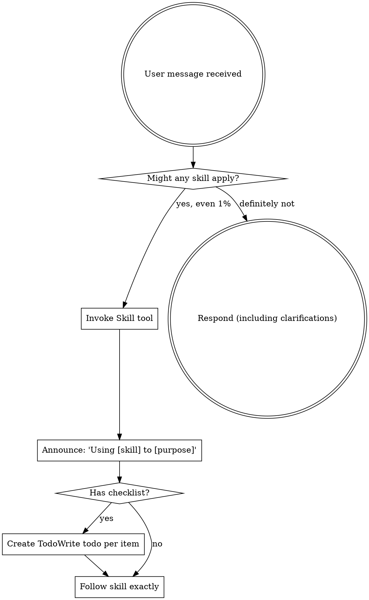

<EXTREMELY-IMPORTANT>
현재 수행하려는 작업에 스킬이 적용될 가능성이 1%라도 있다면, 반드시 스킬을 호출해야 합니다.

당신의 작업에 적용되는 스킬이 있다면 선택권은 없습니다. 반드시 사용해야 합니다.

이 규칙은 협상 대상이 아닙니다. 선택 사항이 아닙니다. 합리화로 우회할 수 없습니다.
</EXTREMELY-IMPORTANT>

## How to Access Skills

**In Claude Code:** `Skill` 도구를 사용합니다. 스킬을 호출하면 해당 내용이 로드되어 제공되며, 그대로 따르십시오. 스킬 파일에 `Read` 도구를 사용하지 마십시오.

**In other environments:** 스킬 로딩 방식은 해당 플랫폼 문서를 확인하십시오.

# Using Skills

## The Rule

**응답이나 행동 전에 관련/요청된 스킬을 먼저 호출합니다.** 스킬이 적용될 가능성이 1%라도 있으면 먼저 호출해 확인해야 합니다. 호출한 스킬이 현재 상황에 맞지 않다는 것이 확인되면 그때 사용하지 않으면 됩니다.

## Red Flags

아래 생각이 들면 즉시 멈추십시오. 합리화 신호입니다.

| Thought | Reality |
|---------|---------|
| "이건 그냥 간단한 질문이야" | 질문도 작업입니다. 스킬부터 확인하십시오. |
| "먼저 맥락을 좀 더 알아야 해" | 명확화 질문보다 스킬 확인이 먼저입니다. |
| "코드베이스를 먼저 둘러보자" | 코드를 어떻게 탐색할지도 스킬이 안내합니다. 먼저 확인하십시오. |
| "git/files만 빠르게 확인하면 돼" | 파일만으로는 대화 맥락이 없습니다. 스킬부터 확인하십시오. |
| "정보를 먼저 수집하자" | 정보 수집 방법 자체를 스킬이 제공합니다. |
| "이건 정식 스킬까지는 필요 없어" | 관련 스킬이 있으면 사용해야 합니다. |
| "이 스킬은 기억하고 있어" | 스킬은 바뀝니다. 최신 버전을 확인하십시오. |
| "이건 작업으로 치기 애매해" | 행동이 수반되면 작업입니다. 스킬부터 확인하십시오. |
| "이 스킬은 과해" | 단순한 일도 복잡해질 수 있습니다. 사용하십시오. |
| "이 한 가지만 먼저 하고" | 무엇이든 하기 전에 먼저 확인하십시오. |
| "지금 방식이 더 생산적이야" | 무규율 행동은 시간을 낭비합니다. 스킬이 이를 방지합니다. |
| "의미는 아니까 됐어" | 개념 이해와 스킬 적용은 다릅니다. 호출하십시오. |

## Skill Priority

여러 스킬이 동시에 적용 가능하면 다음 순서를 따릅니다.

1. **Process skills 먼저** (`brainstorming`, `debugging`) - 작업 접근 방식을 결정
2. **Implementation skills 다음** (`frontend-design`, `mcp-builder`) - 실행 방법 안내

"X를 만들자" -> 먼저 brainstorming, 그 다음 implementation skills.
"이 버그를 고쳐" -> 먼저 debugging, 그 다음 도메인 스킬.

## Skill Types

**Rigid** (TDD, debugging): 정확히 따르십시오. 규율을 임의로 변형하지 마십시오.

**Flexible** (patterns): 원칙을 맥락에 맞게 조정할 수 있습니다.

어떤 유형인지 스킬 본문이 명시합니다.

## User Instructions

사용자 지시는 WHAT(무엇)를 말합니다. HOW(어떻게)는 아닙니다. "X 추가", "Y 수정"이 워크플로우 생략 허용을 의미하지 않습니다.
